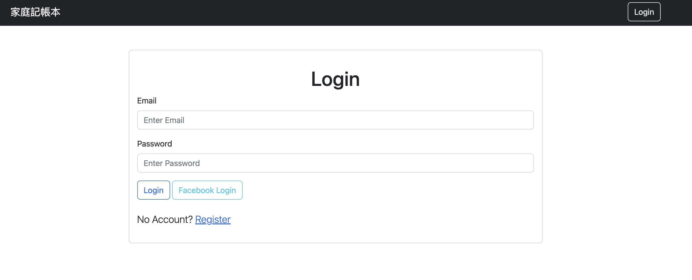
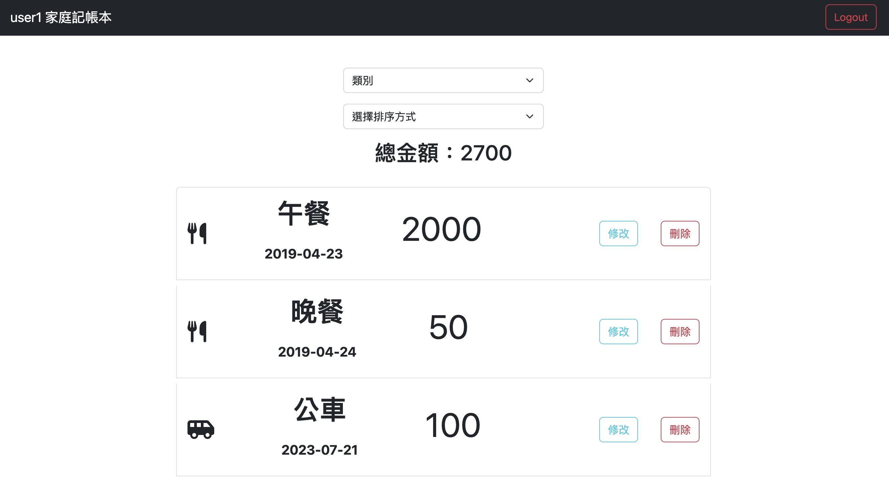

# AC-3-A3-老爸的私房錢




## Features

- User Register
- User login / logout
- User Facebook login
- List user's all expense record.
- Filter record by category.
- Sort by date or amount.
- Create a record,
- Edit a record.
- Delete a restaurant.
- Show total amount by category.

## 使用
## How to use

1. Clone the Repo to local server.
```bash
    git clone https://github.com/paulwu-tw/restaurants.git
```

2. Install need package by follow cmd.
```bash
    npm install
```

3. Accroding to .env.example file, config required info below.
```bash
    # Mongo db connect info
    MONGODB_URI=<Your own connection string>
    MONGODB_USER=<Username>
    MONGODB_PASSWORD=<Password>

    # Session secret
    SESSION_SECRET=<YOUR_SESSION_SECRET>

    # Facebook App info
    FACEBOOK_ID=SKIP
    FACEBOOK_SECRET=SKIP
```

4. Create test data
```bash
    npm run seed
```
- seeds offer 2 account below
    
    ||Name|Email|Password|
    |:--|:--:|:--:|:--:|
    |1|user1|user1@gmail.com|1111|
    |2|user2|user2@gmail.com|1111|

5. Start server for demo.
```bash
    npm run start
```

6. While see the message below, open browser and enter the following URL. 
```bash
    Listen on http://localhost:3000
```

7. Stop server
```bash
    cmd + c
```

## 開發工具
- node.js 18.15.0
- express 4.18.2
- express-handlebars 7.0.7
- express-session 1.17.1
- bootstrap 5.3.0
- font-awesome 5.8.1
- body-parser 1.20.2
- dotenv 16.0.3
- mongoose 7.1.0
- method-override 3.0.0
- bcryptjs 2.4.3
- connect-flash 0.1.1
- passport 0.4.1,
- passport-facebook 3.0.0
- passport-local 1.0.0